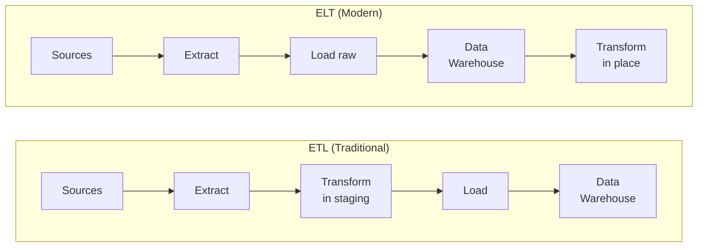
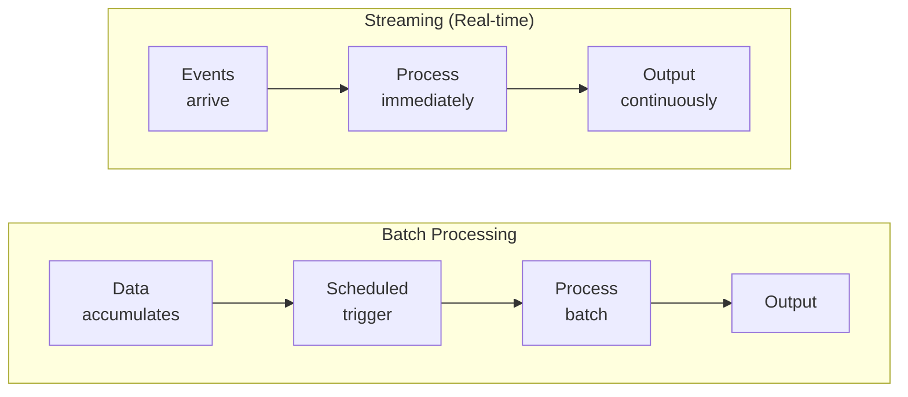
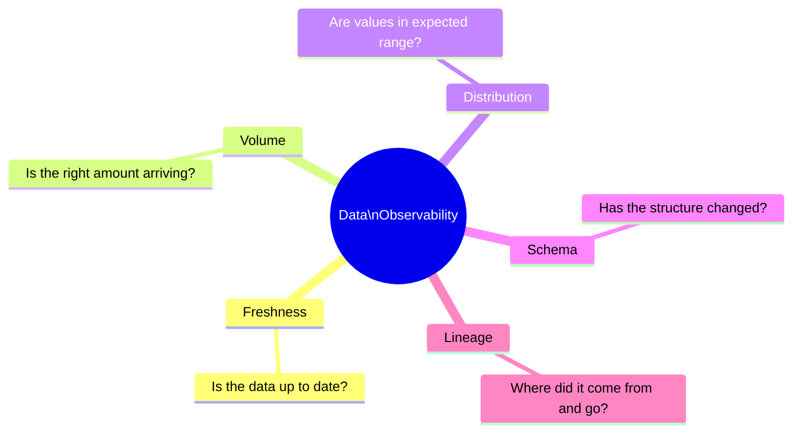
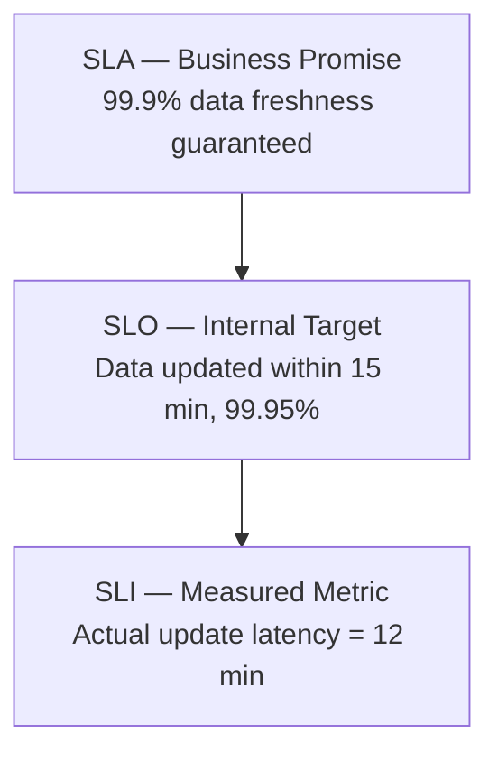
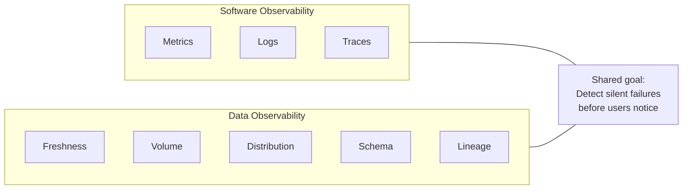

import { Card, CardGrid, LinkCard } from '@astrojs/starlight/components';

## About This Module

Before you can build an observability platform, you need to understand what you're observing. This module covers the foundational concepts: what data pipelines are, how data observability differs from traditional software monitoring, and which technologies power modern data infrastructure.

As a PM on Google's Core Data team, you'll encounter pipelines that move petabytes of data for Maps and Gemini. Understanding how these pipelines work — and how they fail — is the foundation for everything else in this study plan.

**Estimated Study Time: 2.5 hours**

---

## Section 1: What Are Data Pipelines — ETL vs ELT, Batch vs Streaming

A **data pipeline** is a series of processing steps that moves data from source systems to destinations where it can be analyzed or consumed. Think of it as a factory assembly line for data — raw materials (source data) go in, finished products (clean, transformed data) come out.

There are two dominant paradigms:

- **ETL (Extract, Transform, Load)**: Data is extracted from sources, transformed in a staging area, then loaded into the destination. Traditional approach used when compute was expensive and storage was limited.
- **ELT (Extract, Load, Transform)**: Data is extracted and loaded raw into a destination (like a data lake or warehouse), then transformed in place. Modern approach enabled by cheap cloud storage and powerful query engines like BigQuery.

Pipelines also differ by timing:

- **Batch processing**: Data is collected over a period and processed together at scheduled intervals (hourly, daily). Good for large-volume analytics where latency tolerance is high.
- **Streaming (real-time)**: Data is processed continuously as it arrives. Essential when freshness matters — fraud detection, live dashboards, real-time recommendations.

> **Key Insight**: "The shift from ETL to ELT reflects a broader trend: storage became cheap, compute became elastic, and transformation logic moved closer to the analysts who understand the business context."
> — [Fundamentals of Data Engineering, O'Reilly](https://www.oreilly.com/library/view/fundamentals-of-data/9781098108298/)

### Resources

- 📚 [Fundamentals of Data Engineering — O'Reilly](https://www.oreilly.com/library/view/fundamentals-of-data/9781098108298/) — Comprehensive guide to data engineering concepts including ETL/ELT and pipeline architecture
- 📄 [ETL vs ELT: Key Differences Explained — IBM](https://www.ibm.com/think/topics/etl-vs-elt) — Clear comparison of the two approaches with use cases
- 📄 [Batch vs Stream Processing — Confluent](https://www.confluent.io/learn/batch-vs-real-time-data-processing/) — Explains when to use batch vs streaming with architectural tradeoffs
- 📄 [What is a Data Pipeline? — AWS](https://aws.amazon.com/what-is/data-pipeline/) — Accessible overview of pipeline concepts and components

---

## Section 2: The 5 Pillars of Data Observability

**Data observability** is the ability to fully understand the health and state of data in your system. The concept was popularized by Barr Moses (CEO of Monte Carlo) who defined five key pillars:

1. **Freshness**: Is the data up to date? When was it last updated? Stale data can lead to bad decisions — imagine a dashboard showing yesterday's data when leadership expects real-time.

2. **Volume**: Is the amount of data within expected ranges? A sudden drop in row counts could mean a broken pipeline. A sudden spike could mean duplicate data flooding downstream systems.

3. **Distribution**: Are the values in the data within expected ranges? If a column that normally has values between 0-100 suddenly shows values of -999, something went wrong upstream.

4. **Schema**: Has the structure of the data changed? Schema changes (dropped columns, type changes) are one of the most common causes of pipeline failures.

5. **Lineage**: Where did this data come from, what happened to it along the way, and who or what is affected when it changes? Lineage is the map that tells you the full story of your data's journey.

> **Key Insight**: "Data observability is not just monitoring with a new name. Monitoring tells you *when* something breaks. Observability helps you understand *why* it broke and *what* is affected downstream."
> — [What Is Data Observability? — Monte Carlo](https://www.montecarlodata.com/blog-what-is-data-observability/)

### Resources

- 📄 [What Is Data Observability? 5 Key Pillars — Monte Carlo](https://www.montecarlodata.com/blog-what-is-data-observability/) — The definitive introduction to data observability from the company that coined the term
- 📄 [Introducing the Five Pillars of Data Observability — Barr Moses](https://towardsdatascience.com/introducing-the-five-pillars-of-data-observability-e73734b263d5/) — The original article by Monte Carlo's CEO laying out the 5-pillar framework
- 📄 [Data Observability — Airbyte](https://airbyte.com/data-engineering-resources/data-observability) — Practical guide covering observability implementation for data engineers
- 📚 [Fundamentals of Data Observability — O'Reilly](https://www.oreilly.com/library/view/fundamentals-of-data/9781098133283/) — Book-length treatment of data observability concepts and implementation
- 📄 [5 Crucial Pillars of Data Observability — RisingWave](https://risingwave.com/blog/5-crucial-pillars-of-data-observability-for-modern-data-management/) — Practical overview of each pillar with real-world examples

---

## Section 3: Data Quality Fundamentals and SLAs/SLIs/SLOs for Data

Data quality is the measure of how well data serves its intended purpose. Poor data quality costs organizations an estimated [$12.9 million per year on average](https://www.gartner.com/smarterwithgartner/how-to-improve-your-data-quality) (Gartner).

The key dimensions of data quality include:

- **Accuracy**: Does the data correctly represent the real-world entity it describes?
- **Completeness**: Are all required fields populated?
- **Consistency**: Does the same data agree across different systems?
- **Timeliness**: Is the data available when needed?
- **Validity**: Does the data conform to its defined format and business rules?

To manage data quality at scale, teams borrow from site reliability engineering (SRE):

- **SLA (Service Level Agreement)**: A formal promise to stakeholders. "Dashboard data will be no more than 1 hour stale, 99.5% of the time."
- **SLO (Service Level Objective)**: An internal target that's typically stricter than the SLA. "Dashboard data will be no more than 30 minutes stale, 99.9% of the time."
- **SLI (Service Level Indicator)**: The actual measurement. "Right now, dashboard data is 23 minutes stale."

> **Key Insight**: "Treating data pipelines like production services — with SLAs, SLOs, and SLIs — is the shift that separates mature data organizations from those constantly firefighting data quality issues."
> — [Fundamentals of Data Observability, O'Reilly](https://www.oreilly.com/library/view/fundamentals-of-data/9781098133283/)

### Resources

- 📄 [Data Quality: What, Why, How — Atlan](https://atlan.com/data-quality/) — Comprehensive overview of data quality dimensions and frameworks
- 📄 [SLOs for Data Pipelines — dbt Labs Blog](https://www.getdbt.com/blog/operational-analytics-slos) — How to apply SRE concepts to data pipeline reliability
- 📚 [Data Observability for Data Engineering — O'Reilly](https://www.oreilly.com/library/view/data-observability-for/9781804616024/) — Covers data quality metrics and operationalizing observability
- 📄 [Site Reliability Engineering — Google SRE Book (Ch. 4: SLOs)](https://sre.google/sre-book/service-level-objectives/) — The original Google SRE chapter on SLIs, SLOs, and SLAs — directly applicable to data

---

## Section 4: Data Observability vs Software Observability — What's Different

If you're coming from a software engineering background, you already know the three pillars of **software observability**: logs, metrics, and traces. Data observability shares the same goal — understanding system health — but differs in important ways:

| Aspect | Software Observability | Data Observability |
|--------|----------------------|-------------------|
| **What you monitor** | Application behavior (latency, errors, throughput) | Data health (freshness, volume, schema, distribution, lineage) |
| **Failure modes** | Crashes, timeouts, errors | Silent data corruption, stale data, schema drift, missing rows |
| **Detection difficulty** | Errors are often loud (500s, exceptions) | Data issues are often silent — the pipeline "succeeds" but the data is wrong |
| **Blast radius** | Immediate user impact (broken UI, failed requests) | Delayed impact — bad data flows downstream, corrupts dashboards and ML models |
| **Tools** | Datadog, Grafana, New Relic, PagerDuty | Monte Carlo, Great Expectations, Soda, dbt tests |

The key difference: **software failures are loud, data failures are silent**. A web server returning 500 errors triggers alerts immediately. A pipeline that silently drops 20% of rows may not be noticed for days — until an executive asks why the revenue numbers look off.

> **Key Insight**: "The hardest data problems aren't the ones that crash your pipelines. They're the ones where the pipeline completes successfully but the data is wrong."
> — [Data Observability — Airbyte](https://airbyte.com/data-engineering-resources/data-observability)

### Resources

- 📄 [Data Observability — Airbyte](https://airbyte.com/data-engineering-resources/data-observability) — Contrasts data observability with traditional monitoring approaches
- 📄 [Observability Engineering — O'Reilly](https://www.oreilly.com/library/view/observability-engineering/9781492076438/) — The definitive guide on software observability — useful to understand the baseline
- 📄 [OpenTelemetry for Data Pipelines — BIX Tech](https://bix-tech.com/distributed-observability-for-data-pipelines-with-opentelemetry-a-practical-endtoend-playbook-for-2026/) — How OpenTelemetry (software observability standard) is being adapted for data pipelines

---

## Section 5: Key Technologies to Know

These are the core technologies you'll encounter in pipeline and data infrastructure conversations:

### Apache Beam
A unified programming model for both batch and streaming data processing. You write your pipeline once, and it runs on multiple execution engines (called "runners") — including Google Cloud Dataflow, Apache Spark, and Apache Flink. Beam was created at Google based on their internal [FlumeJava](https://research.google/pubs/flumejava-easy-efficient-data-parallel-pipelines/) and [MillWheel](https://research.google/pubs/millwheel-fault-tolerant-stream-processing-at-internet-scale/) systems.

### Apache Spark
The most widely-used distributed data processing engine. Handles batch processing, streaming (via Structured Streaming), machine learning (MLlib), and graph processing. If Beam is the "write once, run anywhere" model, Spark is the most popular "anywhere."

### Apache Kafka
A distributed event streaming platform used for building real-time data pipelines. Kafka acts as a high-throughput, low-latency message broker between systems. Think of it as a highway for events — producers publish messages, consumers read them, and Kafka guarantees ordering and durability.

### Google Cloud Dataflow
Google's fully managed service for running Apache Beam pipelines. It auto-scales, handles resource management, and provides built-in monitoring. Dataflow is the public cloud version of Google's internal pipeline infrastructure.

> **Key Insight**: "Apache Beam exists because Google realized that batch and streaming were not fundamentally different problems — they're both about processing data, just with different latency requirements."
> — [Apache Beam Programming Guide](https://beam.apache.org/documentation/programming-guide/)

### Resources

- 📄 [Apache Beam Programming Guide](https://beam.apache.org/documentation/programming-guide/) — Official guide to Beam's unified batch/streaming model
- 📄 [Apache Spark Overview](https://spark.apache.org/docs/latest/) — Official Spark documentation and architecture overview
- 📄 [Apache Kafka Introduction](https://kafka.apache.org/intro) — Official intro to Kafka's event streaming architecture
- 📄 [Google Cloud Dataflow Documentation](https://cloud.google.com/dataflow/docs/overview) — How Dataflow runs Beam pipelines at scale
- 📄 [FlumeJava: Easy, Efficient Data-Parallel Pipelines — Google Research](https://research.google/pubs/flumejava-easy-efficient-data-parallel-pipelines/) — The Google paper that inspired Apache Beam

---

## Key Takeaways

- **Data pipelines** are the assembly lines of data infrastructure — understanding ETL/ELT and batch/streaming is table stakes for your role.
- The **5 pillars of data observability** (freshness, volume, distribution, schema, lineage) give you a framework for evaluating any observability platform — including the one you're building.
- **SLAs/SLOs/SLIs for data** are borrowed from SRE and are the language your engineering partners speak. Learn to define data reliability in these terms.
- **Data failures are silent** — unlike software failures. This is why observability (not just monitoring) matters so much.
- **Beam, Spark, Kafka, and Dataflow** are the technologies that power the pipelines you'll be building observability for. You don't need to code in them, but you need to understand their architecture and failure modes.

---

## Reflect & Apply

1. **Think about the 5 pillars in your team's context**: For pipelines serving Google Maps data, which pillar is likely the most critical? What about for Gemini training data? Are they the same or different?

2. **Consider the "silent failure" problem**: How would you design an observability platform that catches data quality issues *before* they impact downstream consumers? What would the alert thresholds look like?

3. **SLOs for your platform**: If you were defining SLOs for the observability platform itself (not just the pipelines it monitors), what metrics would you track? How would you define "reliability" for an observability tool?
