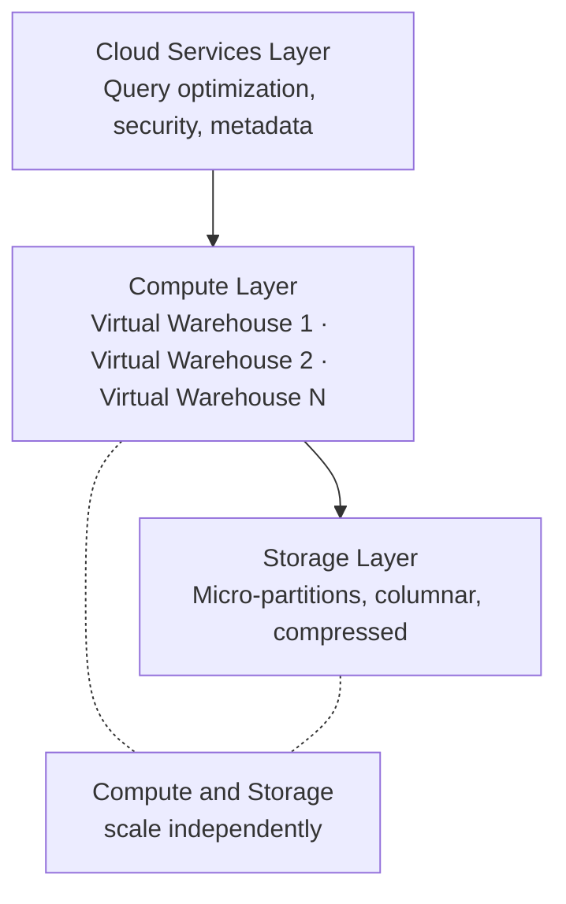
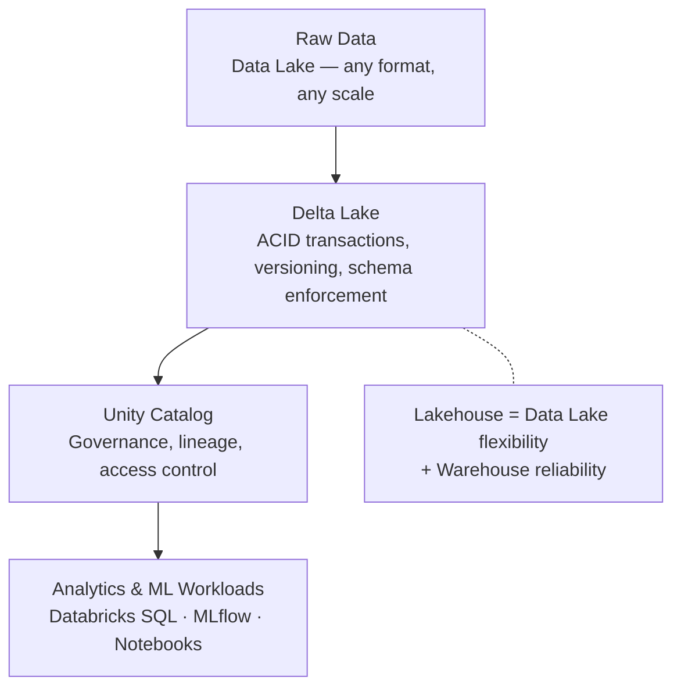
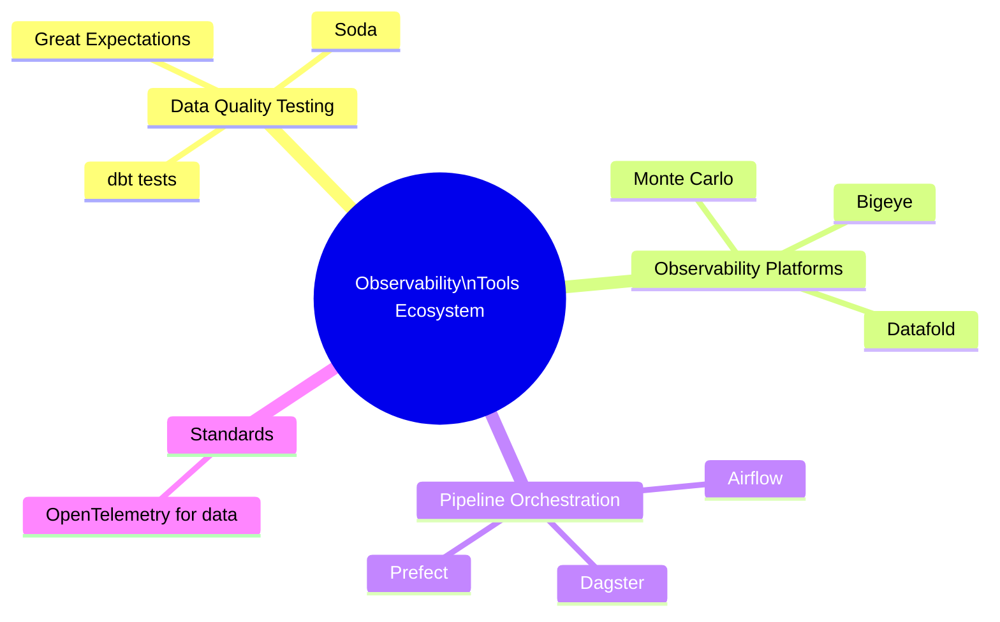
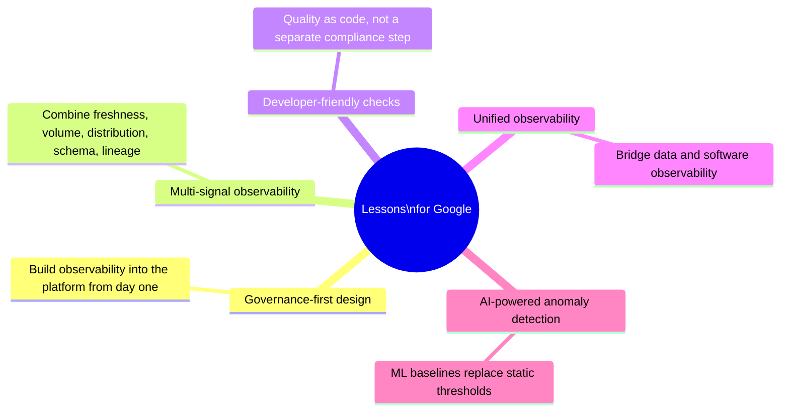

import { Card, CardGrid, LinkCard } from '@astrojs/starlight/components';

## About This Module

Before building Google's internal observability platform, it's essential to understand what the external market already offers. Snowflake and Databricks are the two dominant players in cloud data platforms, and both have made major investments in observability. A growing ecosystem of third-party tools (Monte Carlo, Great Expectations, Soda, dbt) fills the gaps.

This module gives you the competitive landscape — what's out there, what works, what doesn't, and what patterns you can apply to your internal platform.

**Estimated Study Time: 2 hours**

---

## Section 1: Snowflake Architecture and Observability Features

**Snowflake** is a cloud-native data warehouse built around a unique architecture that separates compute from storage. This separation is fundamental — it means you can scale query processing independently from data storage, and multiple compute clusters ("virtual warehouses") can access the same data simultaneously.

### Key architectural components:

- **Cloud Services Layer**: Handles authentication, metadata management, query optimization, and access control
- **Query Processing Layer**: Virtual warehouses that execute SQL queries — each is an independent compute cluster
- **Storage Layer**: Centralized, compressed, columnar storage managed entirely by Snowflake

### Observability features:
- **Snowsight**: Snowflake's web UI with built-in dashboards for query performance, warehouse utilization, and cost monitoring
- **Query Profile**: Visual execution plan that shows how a query ran — essential for performance debugging
- **Resource Monitors**: Set credit usage thresholds and alerts to control cloud spend
- **Account Usage Views**: System tables tracking query history, login history, storage usage, and more
- **Snowflake + Observe acquisition (2025)**: Snowflake acquired Observe Inc. to bring full-stack AI-powered observability natively into the Snowflake platform — signaling that data platforms increasingly see observability as core, not peripheral

> **Key Insight**: "Snowflake's acquisition of Observe signals a strategic shift: data platforms are no longer content to just store and process data — they want to own the observability story end-to-end."
> — [Snowflake Announces Intent to Acquire Observe](https://www.snowflake.com/en/news/press-releases/snowflake-announces-intent-to-acquire-observe-to-deliver-ai-powered-observability-at-enterprise-scale/)

### Resources

- 📄 [Snowflake Architecture Overview — Snowflake Docs](https://docs.snowflake.com/en/user-guide/intro-key-concepts) — Official documentation of Snowflake's three-layer architecture
- 📄 [Snowflake Announces Intent to Acquire Observe — Press Release](https://www.snowflake.com/en/news/press-releases/snowflake-announces-intent-to-acquire-observe-to-deliver-ai-powered-observability-at-enterprise-scale/) — The acquisition that brought AI-powered observability into Snowflake
- 📄 [5 Reasons Snowflake Acquiring Observe Sets Tone for 2026 — Futurum Group](https://futurumgroup.com/insights/5-reasons-snowflake-acquiring-observe-sets-the-tone-for-2026/) — Analyst perspective on the strategic implications
- 📄 [5 Top Snowflake Observability Tools — ChaosGenius](https://www.chaosgenius.io/blog/snowflake-observability-tools/) — Survey of the Snowflake observability ecosystem, both native and third-party

---

## Section 2: Databricks Lakehouse Architecture and Observability

**Databricks** pioneered the **Lakehouse** architecture — a hybrid that combines the best of data lakes (cheap storage for raw data, support for all file types) with data warehouse features (ACID transactions, schema enforcement, fast SQL queries).

### Key architectural components:

- **Delta Lake**: Open-source storage layer that brings reliability to data lakes with ACID transactions, time travel, and schema enforcement
- **Unity Catalog**: Centralized governance layer for all data and AI assets — provides fine-grained access control, lineage tracking, and data discovery across the entire Lakehouse
- **Databricks SQL**: Serverless SQL analytics engine optimized for BI workloads
- **MLflow**: Open-source platform for the complete ML lifecycle — experiment tracking, model registry, deployment

### Observability features:
- **Lakehouse Monitoring**: Automated quality monitoring for tables and ML models — tracks statistics, drift, and custom metrics over time
- **Unity Catalog Lineage**: Automatically captures column-level lineage across tables, notebooks, workflows, and ML models
- **System Tables**: Built-in audit logs, billing usage, query history accessible as Delta tables — you can query your observability data with SQL
- **Databricks Workflows Monitoring**: Pipeline run tracking, alerting, and failure analysis for orchestrated jobs

> **Key Insight**: "Unity Catalog represents a fundamental shift in data governance — instead of bolting governance on after the fact, Databricks built it into the platform foundation. Observability and lineage are not features; they're properties of the system."
> — [What's New in Databricks Unity Catalog — Databricks Blog](https://www.databricks.com/blog/whats-new-databricks-unity-catalog-data-ai-summit-2025)

### Resources

- 📄 [Lakehouse Architecture — Databricks](https://www.databricks.com/glossary/data-lakehouse) — Official explanation of the Lakehouse paradigm
- 📄 [Lakehouse Monitoring — Databricks Product Page](https://www.databricks.com/product/machine-learning/lakehouse-monitoring) — Automated quality monitoring for tables and ML models
- 📄 [Databricks Lakehouse Monitoring — Microsoft Learn](https://learn.microsoft.com/en-us/azure/databricks/lakehouse-monitoring/) — Practical documentation for setting up monitoring on Azure Databricks
- 📄 [What's New in Unity Catalog — Databricks Blog](https://www.databricks.com/blog/whats-new-databricks-unity-catalog-data-ai-summit-2025) — Latest governance and lineage capabilities
- 📄 [Unity Catalog AI-Native Data Governance — DZone](https://dzone.com/articles/unity-catalog-ai-databricks-data-governance) — How Unity Catalog brings AI-native governance to the data platform

---

## Section 3: Observability Tools Ecosystem

Beyond the platform-native tools from Snowflake and Databricks, a rich ecosystem of specialized observability and data quality tools has emerged:

### Monte Carlo — Data Observability Platform
The company that coined "data observability." Monte Carlo provides automated monitoring across the 5 pillars (freshness, volume, distribution, schema, lineage). It integrates with data warehouses, lakes, ETL tools, and BI platforms. Think of it as "Datadog for data."

### Great Expectations — Data Validation Framework
An open-source Python framework for defining, documenting, and validating data expectations. You write "expectations" (e.g., "this column should never be null", "row count should be between 1M and 2M") and Great Expectations validates your data against them. Popular for data pipeline testing.

### Soda — Data Quality Platform
Offers both open-source (Soda Core) and commercial products for data quality checks. Uses a YAML-based configuration language called SodaCL that's designed to be readable by non-engineers — making data quality accessible to analysts and PMs.

### dbt Tests — Data Transformation Testing
dbt (data build tool) is primarily a transformation tool, but its built-in testing framework is widely used for data quality. Schema tests (unique, not null, accepted values, relationships) and custom SQL tests run automatically as part of the transformation pipeline.

### OpenTelemetry for Data
The [OpenTelemetry](https://opentelemetry.io/) standard — originally designed for software observability (traces, metrics, logs) — is being extended to data pipelines. This is an emerging area that could unify data and software observability under one framework.

> **Key Insight**: "The data observability market is converging: platform vendors are building native observability, while third-party tools are expanding to cover more platforms. The winning pattern is 'deep integration with the developer workflow' — not just dashboards."
> — [Top Data Observability Tools 2026 — Atlan](https://atlan.com/know/data-observability-tools/)

### Resources

- 📄 [Monte Carlo Architecture — Docs](https://docs.getmontecarlo.com/docs/architecture) — How Monte Carlo's data observability platform works under the hood
- 📄 [Top Data Observability Tools 2026 — Atlan](https://atlan.com/know/data-observability-tools/) — Comprehensive comparison of 14 data observability tools with features and pricing
- 📄 [Open-Source Data Quality Landscape 2026 — DataKitchen](https://datakitchen.io/the-2026-open-source-data-quality-and-data-observability-landscape/) — Map of the open-source data quality and observability ecosystem
- 📄 [OpenTelemetry — Official Site](https://opentelemetry.io/) — The emerging standard for unified observability across software and data
- 📄 [Great Expectations Documentation](https://docs.greatexpectations.io/docs/) — Official docs for the open-source data validation framework

---

## Section 4: Patterns and Lessons for Google's Internal Platform

What can you take from the external landscape and apply to your internal observability platform? Several patterns emerge:

### Pattern 1: Governance-First Design (from Databricks Unity Catalog)
Don't bolt observability on after the fact. Build it into the platform from the start. Unity Catalog's success comes from making lineage, access control, and quality monitoring inherent properties of the system — not separate tools you have to integrate.

### Pattern 2: Multi-Signal Observability (from Monte Carlo)
Don't monitor just one dimension. The 5-pillar framework (freshness, volume, distribution, schema, lineage) provides comprehensive coverage because different failure modes show up in different signals. A freshness alert catches late pipelines; a distribution alert catches data corruption.

### Pattern 3: Developer-Friendly Quality Checks (from dbt + Great Expectations)
Make quality checks part of the development workflow, not a separate compliance step. dbt succeeded because tests run alongside transformations. Great Expectations succeeded because expectations are defined in code, not a GUI.

### Pattern 4: Unified Data + Software Observability (from OpenTelemetry)
The boundary between "data observability" and "software observability" is artificial. Pipeline failures are often caused by infrastructure issues (memory, network, dependencies). The future is unified observability — and OpenTelemetry is the emerging bridge.

### Pattern 5: AI-Powered Anomaly Detection (from Snowflake/Observe)
Static thresholds don't scale. With thousands of tables and millions of columns, you can't manually set alert rules for everything. ML-based anomaly detection learns normal patterns and flags deviations automatically — this is where the industry is heading.

> **Key Insight**: "The platforms that win are the ones that make observability invisible — not a tool you go to, but a property of the system that's always working in the background."

### Resources

- 📄 [OpenTelemetry for Data Pipelines — BIX Tech](https://bix-tech.com/distributed-observability-for-data-pipelines-with-opentelemetry-a-practical-endtoend-playbook-for-2026/) — Practical playbook for applying OpenTelemetry to data pipeline observability
- 📄 [Top Observability Tools for Platform Engineers 2026 — Platform Engineering](https://platformengineering.org/blog/10-observability-tools-platform-engineers-should-evaluate-in-2026) — Which tools platform teams are adopting and why
- 📄 [Top Data Observability Tools 2026 — Integrate.io](https://www.integrate.io/blog/top-data-observability-tools/) — Comparative analysis of leading data observability tools

---

## Key Takeaways

- **Snowflake** separates compute from storage and is integrating observability deeply through the Observe acquisition — observability is becoming a platform feature, not an add-on.
- **Databricks** built governance and observability into the Lakehouse from the foundation (Unity Catalog, Lakehouse Monitoring) — the "governance-first" model is worth studying.
- The **third-party ecosystem** (Monte Carlo, Great Expectations, Soda, dbt) shows what users want when platform-native tools fall short — automated anomaly detection, code-based quality checks, and comprehensive lineage.
- **OpenTelemetry** is the emerging bridge between software and data observability — worth tracking for its potential to unify the stack.
- **The winning pattern** across all of these: make observability invisible, developer-friendly, and AI-powered.

---

## Reflect & Apply

1. **Platform vs. third-party**: Snowflake acquired Observe; Databricks built Unity Catalog natively. For Google's internal platform, should observability be a core platform feature or a pluggable add-on? What are the tradeoffs?

2. **Which external patterns apply?**: Of the 5 patterns identified (governance-first, multi-signal, developer-friendly, unified observability, AI-powered), which 2-3 are most critical for Google's Core Data team? Why?

3. **The dbt lesson**: dbt tests succeeded because they run alongside transformations — quality checks are part of the development workflow, not a separate step. How could you bring this same "quality-as-code" philosophy to Google's internal pipelines?
