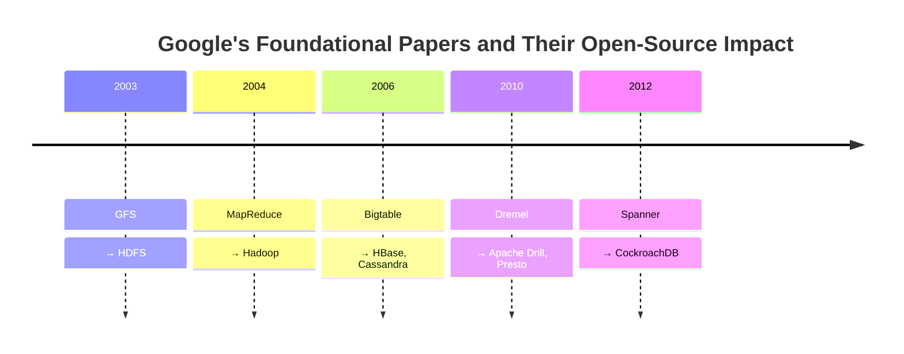
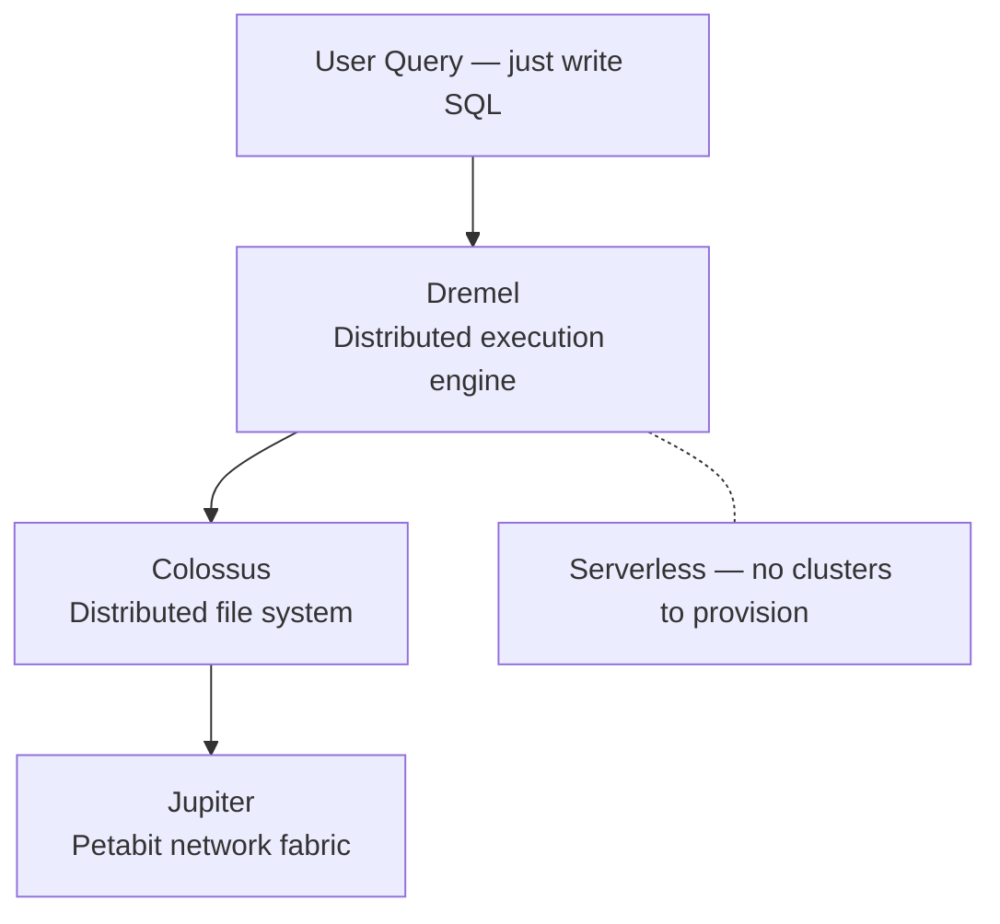
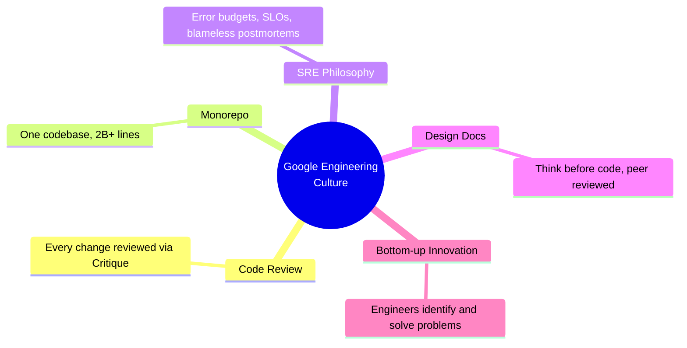
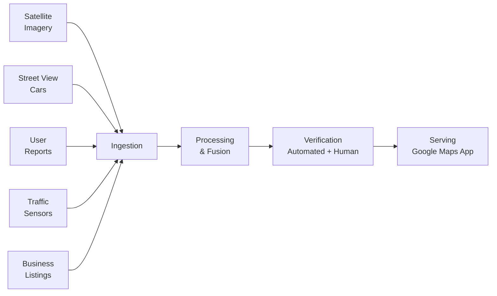

import { Card, CardGrid, LinkCard } from '@astrojs/starlight/components';

## About This Module

Google essentially invented modern distributed data infrastructure. The papers that came out of Google in the 2000s — MapReduce, Bigtable, GFS, Spanner — didn't just shape Google's internal systems. They spawned the entire Hadoop/Spark/NoSQL ecosystem that the rest of the industry uses today.

Understanding this history gives you two things: (1) context for the internal tools you'll encounter, and (2) appreciation for the engineering culture that produced them. This module covers the foundational papers, BigQuery, how Google engineers work, and the publicly known aspects of the Maps and Gemini data landscape.

**Estimated Study Time: 2.5 hours**

---

## Section 1: The Foundational Papers — MapReduce, GFS, Bigtable, Spanner

Google's engineering culture has a tradition of publishing landmark research papers that often become the basis for open-source projects used worldwide. As a PM, you don't need to understand every implementation detail, but you should know what each system does and why it matters.

### MapReduce (2004)
The paper that started it all. MapReduce introduced a simple programming model for processing massive datasets across thousands of machines. You define a `map` function (process each piece of data) and a `reduce` function (aggregate the results). The framework handles parallelization, fault tolerance, and data distribution automatically. MapReduce inspired Apache Hadoop, which powered the first generation of big data systems at companies like Yahoo, Facebook, and LinkedIn.

### Google File System — GFS (2003)
Before you can process data across thousands of machines, you need to *store* it across thousands of machines. GFS was Google's distributed file system — designed to handle massive files on commodity hardware with built-in fault tolerance. GFS inspired HDFS (Hadoop Distributed File System), and its successor at Google is **Colossus**, which powers virtually all of Google's storage today.

### Bigtable (2006)
A distributed database for managing structured data at massive scale. Bigtable powers Google Search indexing, Google Maps, Google Earth, Gmail, and many other products. It's designed for low-latency reads/writes on petabyte-scale datasets. Bigtable directly inspired Apache HBase and Apache Cassandra. Google offers a public version as Cloud Bigtable.

### Spanner (2012)
Google's globally distributed database with external consistency — meaning it guarantees that transactions appear to execute in a single, global order, even across data centers on different continents. Spanner achieves this using GPS and atomic clocks for precise time synchronization (TrueTime). It powers Google's advertising backend and many critical systems. Available publicly as Cloud Spanner.

### Dremel (2010)
The internal query engine that became the foundation for **BigQuery**. Dremel introduced columnar storage with a tree-based execution engine that can scan trillions of rows in seconds. The paper's insight: by storing data in a columnar format and distributing query execution across thousands of nodes, you can make interactive analytics work at massive scale.

> **Key Insight**: "Google's papers didn't just describe their systems — they provided a blueprint that the open-source community used to build Hadoop, HBase, Cassandra, and Spark. Understanding these papers means understanding the DNA of the entire big data ecosystem."
> — [Google Research Archive](https://research.google/pubs/)

### Resources

- 📄 [MapReduce: Simplified Data Processing on Large Clusters (2004) — Google Research](http://static.googleusercontent.com/media/research.google.com/en//archive/mapreduce-osdi04.pdf) — The paper that launched the big data revolution
- 📄 [The Google File System (2003) — Google Research](http://static.googleusercontent.com/media/research.google.com/en//archive/gfs-sosp2003.pdf) — Distributed storage designed for fault tolerance on commodity hardware
- 📄 [Bigtable: A Distributed Storage System for Structured Data (2006) — Google Research](https://research.google.com/archive/bigtable-osdi06.pdf) — The database behind Google Search, Maps, and Gmail
- 📄 [Spanner: Google's Globally-Distributed Database (2012) — Google Research](https://research.google.com/archive/spanner-osdi2012.pdf) — Globally consistent transactions using GPS and atomic clocks
- 📄 [Dremel: Interactive Analysis of Web-Scale Datasets (2010) — Google Research](https://storage.googleapis.com/gweb-research2023-media/pubtools/5750.pdf) — The query engine that became BigQuery

---

## Section 2: BigQuery Architecture and How It Serves Data Teams

**BigQuery** is Google Cloud's serverless data warehouse — and it's the public incarnation of the Dremel engine described above. Understanding BigQuery is valuable because (a) it's Google's flagship data product, and (b) its architecture reflects Google's approach to data infrastructure more broadly.

### Key architectural principles:

- **Serverless**: No infrastructure to manage. You just write SQL and Google handles compute allocation.
- **Separation of storage and compute**: Data is stored in Google's Colossus file system. Query processing runs on Dremel's distributed execution engine. The two scale independently.
- **Columnar storage**: Data is stored in a columnar format optimized for analytical queries — scanning only the columns you need, not entire rows.
- **Petabyte-scale**: Designed to query petabytes of data in seconds, not minutes.

### Why it matters for your role:
BigQuery is likely the closest public analog to the internal data systems your team manages. Understanding how it works — particularly its monitoring, audit logging, and resource management — gives you a mental model for thinking about observability at Google scale.

BigQuery provides built-in observability through:
- **INFORMATION_SCHEMA views**: Metadata about jobs, datasets, tables — query history, resource usage, slot consumption
- **Cloud Audit Logs**: Every API call logged for security and compliance
- **BigQuery Admin resource charts**: Visual dashboards for slot utilization and query patterns

> **Key Insight**: "BigQuery's power comes from the same architectural insight as Dremel: separate storage from compute, store data in columns not rows, and distribute query execution across thousands of nodes. This is Google's approach to data — scale through distribution."
> — [BigQuery Under the Hood — Google Cloud Blog](https://cloud.google.com/blog/products/bigquery/bigquery-under-the-hood)

### Resources

- 📄 [BigQuery Under the Hood — Google Cloud Blog](https://cloud.google.com/blog/products/bigquery/bigquery-under-the-hood) — How BigQuery's architecture works internally
- 📄 [BigQuery Documentation — Google Cloud](https://cloud.google.com/bigquery/docs/introduction) — Official docs covering architecture, SQL, and monitoring capabilities
- 📄 [Colossus: A Peek Behind Google's File System — Google Cloud Blog](https://cloud.google.com/blog/products/storage-data-transfer/a-peek-behind-colossus-googles-file-system) — The storage layer underneath BigQuery and virtually all of Google

---

## Section 3: Google's Engineering Culture and How SWEs/Data Engineers Work

Understanding how Google engineers work helps you understand the context for the observability platform you're building. Google's engineering culture has distinctive characteristics that affect product decisions.

### Key cultural elements:

**Code review is mandatory** — Every change goes through code review using an internal tool called Critique. Chapter 19 of the Google SRE book covers this in detail. The culture of rigorous peer review means engineers expect high-quality, well-documented tools.

**Monorepo** — Google stores virtually all of its code in a single, massive repository (estimated at 2+ billion lines). Developers use internal tools (Piper for version control, CitC for cloud-based workspaces) rather than git. This means developer tooling at Google is deeply integrated and custom-built.

**SRE culture** — Google pioneered Site Reliability Engineering. The SRE philosophy — error budgets, SLOs, blameless postmortems, toil reduction — permeates how teams think about reliability, including data reliability.

**Design docs before code** — Major projects start with a design document that gets reviewed and approved before implementation begins. This means PMs need to be able to participate in and influence the design doc process.

**20% time and bottom-up innovation** — While the "20% time" policy has evolved, the culture of engineers identifying and solving problems they encounter remains strong. Your observability platform will succeed if engineers genuinely find it useful, not because they're told to use it.

> **Key Insight**: "Google's engineering culture puts enormous emphasis on developer productivity and tooling. Engineers expect their tools to be fast, reliable, and integrated into their workflow. If your observability platform creates friction, engineers will route around it."
> — [Software Engineering at Google — O'Reilly / Abseil](https://abseil.io/resources/swe-book)

### Resources

- 📚 [Software Engineering at Google — Free Online Book](https://abseil.io/resources/swe-book) — Comprehensive guide to Google's engineering practices, culture, and tools
- 📄 [Critique: Google's Code Review Tool — SWE Book Ch. 19](https://abseil.io/resources/swe-book/html/ch19.html) — How code review works at Google and why it shapes engineering culture
- 📄 [The Tools I Had to Learn to Write Code at Google — Medium](https://medium.com/javarevisited/the-tools-i-immediately-had-to-learn-to-write-my-first-line-of-code-at-google-piper-citc-and-ae5a042ee90c) — First-person account of onboarding to Google's internal tools (Piper, CitC, Cider)
- 📄 [Google SRE Book — Site Reliability Engineering](https://sre.google/sre-book/table-of-contents/) — The book that defined SRE as a discipline, free online from Google

---

## Section 4: Google Maps and Gemini Data Context — Publicly Known Aspects

Your team manages pipelines for two of Google's most important data domains: Google Maps and Google Gemini. Here's what's publicly known about each.

### Google Maps Data

Google Maps is one of the most data-intensive products in the world. It processes data from:
- **Satellite and aerial imagery** — Regularly updated imagery for the entire planet
- **Street View** — 360-degree street-level imagery from camera-equipped vehicles
- **User contributions** — Reviews, photos, corrections, and local business updates
- **Traffic and mobility data** — Real-time traffic from smartphone GPS signals
- **Partner data** — Business listings, transit schedules, geographic databases

The Maps data pipeline involves continuous ingestion, processing, and quality validation at planetary scale. Observability for Maps data means monitoring freshness (are map tiles up to date?), accuracy (are business listings correct?), and coverage (are new roads reflected?).

### Gemini Training Data
Google Gemini is Google's multimodal AI model family. While the specifics of training data are proprietary, publicly known aspects include:
- **Pre-training data** involves massive, diverse datasets covering text, code, images, audio, and video
- **Post-training** (fine-tuning, RLHF) uses curated datasets to improve model behavior, safety, and helpfulness
- **Data quality is critical** — The quality of training data directly affects model capabilities. "Garbage in, garbage out" applies at an unprecedented scale

For your role, the observability challenge for ML training data is distinct: you need to monitor not just pipeline health, but data composition, quality distributions, bias metrics, and lineage from raw data through to model behavior.

> **Key Insight**: "The quality of AI models is fundamentally bounded by the quality of their training data. For Gemini, data observability isn't just an operational concern — it's a product quality concern."

### Resources

- 📄 [Google Maps Platform Features — Analysis](https://masterconcept.ai/blog/google-cloud-next-2025-in-depth-analysis-of-4-new-google-maps-platform-features-and-potential-industry-applications/) — Recent Google Maps platform capabilities and their data implications
- 📄 [Gemini Training Data Composition — ScaleByTech](https://scalebytech.com/google-gemini-ai-training-dataset-composition) — Publicly known aspects of Gemini's training data approach
- 📄 [TFX with Apache Beam — TensorFlow Blog](https://blog.tensorflow.org/2020/03/tensorflow-extended-tfx-using-apache-beam-large-scale-data-processing.html) — How Google's TFX framework uses Beam for ML data processing pipelines

---

## Key Takeaways

- Google's **foundational papers** (MapReduce, GFS, Bigtable, Spanner, Dremel) didn't just build Google — they defined the entire big data industry. As a PM, knowing this history helps you understand both internal systems and external market context.
- **BigQuery** is the public incarnation of Google's internal data philosophy: serverless, columnar, massively parallel. Its architecture mirrors the approach used internally.
- Google's **engineering culture** (code review, monorepo, SRE, design docs) means your observability platform must be rigorous, well-integrated, and developer-friendly. Engineers here have high standards for internal tools.
- **Maps data** and **Gemini training data** represent two very different observability challenges: geographic data correctness and freshness vs. ML training data quality and composition. Your platform needs to serve both.

---

## Reflect & Apply

1. **Spanner's TrueTime**: Google solved distributed consistency with GPS and atomic clocks. What does this tell you about Google's willingness to invest in custom infrastructure? How might this mindset apply to building a custom observability platform vs. adapting external tools?

2. **Engineering culture fit**: Google engineers are used to best-in-class internal tools. What level of polish and reliability does your observability platform need to achieve for adoption? What happens if it falls below that bar?

3. **Maps vs. Gemini**: The observability needs for geographic data (Maps) are different from ML training data (Gemini). How would you design a platform that serves both? Should it be one product or two? What shared abstractions would work across both domains?
