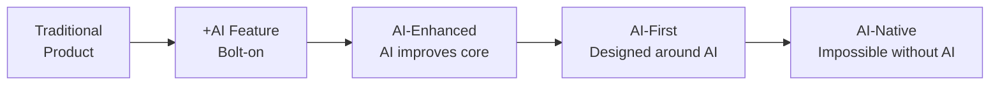
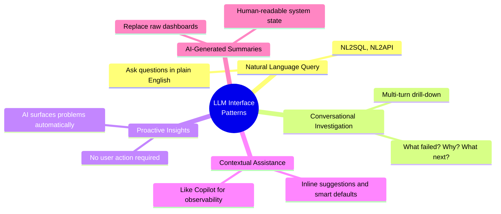
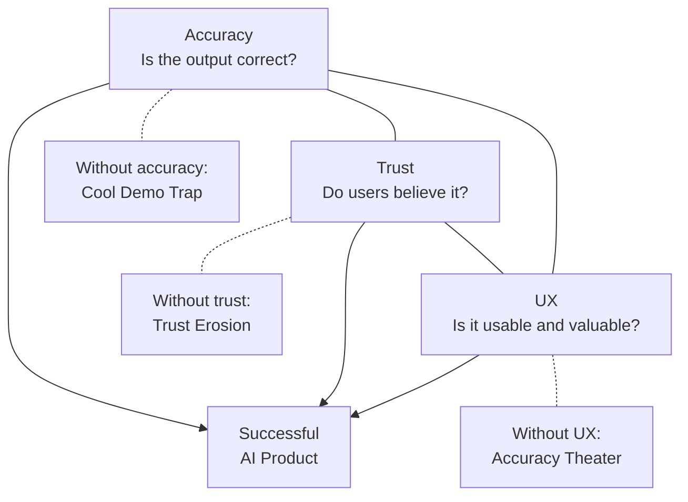
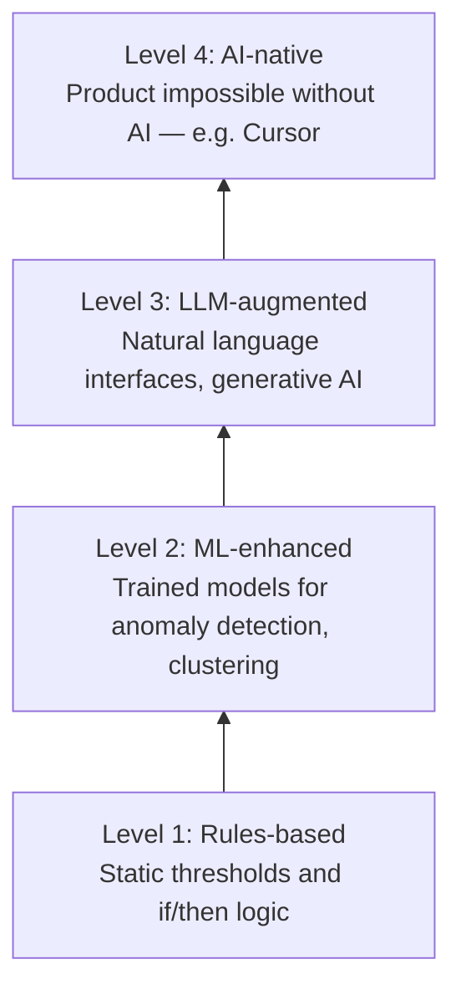

import { Card, CardGrid, LinkCard } from '@astrojs/starlight/components';

## About This Module

"AI-first" isn't just a buzzword — it's a fundamental shift in how products are designed, built, and evaluated. As a PM building an observability platform, your job isn't to add AI as a feature; it's to rethink the entire user experience through the lens of what AI makes possible.

This module covers what AI-first product development looks like in practice, the UX patterns emerging around LLMs, how copilot products like GitHub Copilot and Cursor are setting user expectations, and the frameworks you need to evaluate and ship AI features responsibly.

**Estimated Study Time: 2 hours**

---

## Section 1: What "AI-First" Means for Product Development

**AI-first** means designing your product around AI capabilities from the start — not adding AI to an existing product as an afterthought. The difference is like mobile-first vs. responsive web design: both involve mobile, but the starting assumptions are fundamentally different.

### The shift in product thinking:

| Traditional Product | AI-First Product |
|---|---|
| User explicitly configures rules and thresholds | System learns patterns and flags anomalies automatically |
| User navigates through menus to find information | User asks questions in natural language |
| Dashboards show all data, user filters manually | AI surfaces the most relevant insights proactively |
| Documentation is written by humans, updated manually | Documentation is generated and updated automatically |
| Alerts are based on static rules | Alerts are based on ML-detected pattern changes |

### Key principles for AI-first product development:

1. **Start with the user problem, not the model**: "We have an LLM, what should it do?" is the wrong question. "Users can't quickly understand why their pipeline failed — can AI help?" is the right one.

2. **Design for trust calibration**: Users need to understand when to trust AI output and when to verify. Show confidence levels, explain reasoning, and make it easy to override.

3. **Plan for failure gracefully**: AI will be wrong sometimes. Design the UX so that wrong answers are easy to identify and correct, and never destructive.

4. **Measure differently**: Traditional metrics (clicks, time-on-page) don't capture AI product value. You need metrics like "time to resolution," "accuracy of suggestions," and "user trust over time."

> **Key Insight**: "The most successful AI products are not the ones with the most sophisticated models — they're the ones that found the right problem-model-UX fit. The model is 10% of the product; the experience around it is 90%."
> — [What We Learned Building AI Products — Amplitude](https://amplitude.com/blog/ai-product-learnings-2025)

### Resources

- 📄 [What We Learned Building AI Products in 2025 — Amplitude](https://amplitude.com/blog/ai-product-learnings-2025) — Practical lessons from building AI-powered analytics products
- 📄 [Signals for 2026 — O'Reilly Radar](https://www.oreilly.com/radar/signals-for-2026/) — O'Reilly's perspective on where AI product development is heading
- 📄 [LLM Product Development Guide — Orq.ai](https://orq.ai/blog/llm-product-development) — Practical framework for building products with LLMs

---

## Section 2: LLM-Powered Interfaces and UX Patterns

LLMs are enabling entirely new interaction paradigms. Understanding these patterns helps you design the right AI experiences for your observability platform.

### Emerging UX patterns:

**Natural Language Query (NL2X)**
Users express intent in natural language, and the system translates it to the appropriate action — SQL queries (NL2SQL), API calls, configuration changes, or data visualizations. For observability: "Show me all pipelines that were late in the last 24 hours" becomes a SQL query executed against your metadata store.

**Conversational Investigation**
Multi-turn conversations where the AI helps users drill into problems iteratively. "What failed?" → "Why did it fail?" → "Has this happened before?" → "What should I do about it?" This is the natural interface for incident investigation.

**Proactive Insights**
The AI doesn't wait for the user to ask — it surfaces problems, anomalies, and recommendations automatically. "3 pipelines serving Gemini training data have unusual latency patterns today. Want me to investigate?"

**Contextual Assistance**
AI assistance embedded directly in the user's workflow — not a separate chatbot, but inline suggestions, auto-complete, and smart defaults. Think GitHub Copilot for code, but applied to observability: auto-suggesting alert thresholds, generating pipeline descriptions, or recommending investigation steps.

**AI-Generated Summaries**
Instead of showing raw data or metrics, the AI generates human-readable summaries of system state. "Overall pipeline health is good. 2 of 847 pipelines have freshness violations. The Maps tile pipeline has been 23 minutes late for 3 consecutive runs."

> **Key Insight**: "The best AI interfaces don't replace existing workflows — they accelerate them. A natural language query box that requires context-switching is worse than a smarter version of the tool users already use."
> — [State of LLMs 2025 — Sebastian Raschka](https://magazine.sebastianraschka.com/p/state-of-llms-2025)

### Resources

- 📄 [State of LLMs 2025 — Sebastian Raschka](https://magazine.sebastianraschka.com/p/state-of-llms-2025) — Comprehensive overview of where LLMs are and where they're going
- 📄 [LLM Product Development Guide — Orq.ai](https://orq.ai/blog/llm-product-development) — Patterns for designing LLM-powered product experiences
- 📄 [AI Observability Tools Buyer's Guide 2026 — Braintrust](https://www.braintrust.dev/articles/best-ai-observability-tools-2026) — How AI is being applied to observability tools specifically

---

## Section 3: Copilot Design Patterns

The "copilot" pattern has emerged as the dominant paradigm for AI-assisted tools. Understanding how the best copilots work helps you design your own.

### GitHub Copilot
- **What it does**: AI pair programmer that suggests code inline as you type
- **Why it works**: Zero context-switching — suggestions appear in the IDE where developers already work. It's faster to accept a suggestion than to type from scratch.
- **Key lesson**: The best copilots are invisible until needed and never interrupt the user's flow.

### Google Duet AI / Gemini in Workspace
- **What it does**: AI assistant across Google products — helps write docs, generate presentations, analyze spreadsheets, and write code in Colab
- **Why it works**: Deeply integrated into tools people already use daily. The AI understands the context of what you're working on.
- **Key lesson**: Context is everything. A copilot that knows what document you're editing, what data you're looking at, or what pipeline you're debugging is exponentially more useful than a generic chatbot.

### Cursor
- **What it does**: AI-first code editor (fork of VS Code) where AI is the primary interaction model, not an add-on
- **Why it works**: Designed from the ground up around AI capabilities — the entire UX assumes AI participation in every step of coding.
- **Key lesson**: AI-first design (Module 5, Section 1) produces fundamentally different products than AI-added design. Cursor feels different from "VS Code with Copilot" because it was built with AI as the foundation.

### Applying copilot patterns to observability:
Imagine an "Observability Copilot" that:
- Sits in the engineer's IDE and shows pipeline health inline
- Suggests investigation steps when an anomaly is detected
- Auto-generates root cause analysis for pipeline failures
- Writes the incident postmortem draft from the investigation data
- Recommends alert threshold adjustments based on historical patterns

> **Key Insight**: "The copilot pattern succeeds because it maintains human agency. The user is always in control — the AI suggests, the human decides. This builds trust in a way that fully autonomous systems can't."

### Resources

- 📄 [GitHub Copilot — Official Documentation](https://docs.github.com/en/copilot) — How GitHub Copilot works and its design philosophy
- 📄 [Gemini for Google Workspace — Google](https://workspace.google.com/solutions/ai/) — How Google integrates AI across Workspace products
- 📄 [Cursor — The AI Code Editor](https://www.cursor.com/) — AI-first code editor that reimagines the development experience

---

## Section 4: Evaluating AI Features — Accuracy, Trust, and UX

Shipping AI features requires a different evaluation framework than traditional features. The challenge isn't just "does it work?" — it's "do users trust it?" and "what happens when it's wrong?"

### The evaluation triangle:

**Accuracy** — Is the AI output correct?
- Measure precision and recall for different types of outputs
- Track accuracy across different user segments and use cases
- Set minimum accuracy thresholds below which a feature shouldn't ship

**Trust** — Do users believe the AI output is correct?
- Trust is earned over time and lost in moments
- Over-trust is as dangerous as under-trust (users blindly accepting wrong AI suggestions)
- Transparency (showing reasoning, confidence levels) builds appropriate trust

**UX** — Is the AI feature usable and valuable?
- Faster workflows? Or more friction?
- Easy to verify and correct AI outputs?
- Graceful degradation when the AI is uncertain?

### Common pitfalls:

1. **The "cool demo" trap**: AI features that impress in demos but frustrate in daily use. The demo shows the happy path; real users hit edge cases.
2. **Accuracy theater**: Reporting aggregate accuracy (95%!) that hides poor performance on the cases that matter most.
3. **Trust erosion**: One badly wrong answer can undo months of correct ones. Design for the failure case, not the success case.
4. **The "just add AI" antipattern**: Shipping AI features because leadership wants AI, not because users need it.

> **Key Insight**: "For AI products, the right metric isn't accuracy — it's 'calibrated trust.' Users should trust the AI exactly as much as it deserves to be trusted, no more and no less."

### Resources

- 📄 [What We Learned Building AI Products in 2025 — Amplitude](https://amplitude.com/blog/ai-product-learnings-2025) — Hard-won lessons about evaluating AI features in production
- 📄 [Google PAIR Guidebook — People + AI Research](https://pair.withgoogle.com/guidebook/) — Google's own framework for designing human-AI interactions
- 📄 [AI Observability Tools Buyer's Guide 2026 — Braintrust](https://www.braintrust.dev/articles/best-ai-observability-tools-2026) — How to evaluate AI-powered observability tools

---

## Section 5: AI Product Management Frameworks

As an AI PM, you need frameworks that account for the unique challenges of AI products: non-deterministic outputs, evolving model capabilities, and the need for continuous evaluation.

### Framework 1: Problem-Model-UX Fit
Adapted from product-market fit:
- **Problem fit**: Is there a real user problem that AI can solve better than non-AI approaches?
- **Model fit**: Does a model exist (or can one be built) that solves this problem at acceptable accuracy?
- **UX fit**: Can the model's outputs be delivered in a way that's useful and trustworthy?

All three must align. A great model with a bad UX fails. A great UX with an inaccurate model fails. A great model and UX solving the wrong problem fails.

### Framework 2: The AI Product Maturity Ladder

1. **Rules-based**: Static thresholds and rules (not really AI, but often the right starting point)
2. **ML-enhanced**: Traditional ML models improve specific features (anomaly detection, clustering)
3. **LLM-augmented**: Large language models add natural language interfaces and generative capabilities
4. **AI-native**: The product is designed from the ground up around AI capabilities (like Cursor for code)

Most products should climb the ladder one step at a time, not jump to step 4.

### Framework 3: Continuous Evaluation Loop
AI products require ongoing evaluation, not just launch-time metrics:
- **Pre-launch**: Benchmark accuracy, test edge cases, red-team for failures
- **Launch**: A/B test with real users, monitor trust signals
- **Post-launch**: Track accuracy drift, collect user feedback, retrain models
- **Ongoing**: Monitor for distribution shift, new failure modes, changing user needs

> **Key Insight**: "AI products are never 'done.' The model will drift, user expectations will evolve, and new capabilities will emerge. Build for continuous iteration, not one-time launch."
> — [Signals for 2026 — O'Reilly Radar](https://www.oreilly.com/radar/signals-for-2026/)

### Resources

- 📄 [Signals for 2026 — O'Reilly Radar](https://www.oreilly.com/radar/signals-for-2026/) — Forward-looking analysis of AI product trends and what's next
- 📄 [Google PAIR Guidebook — People + AI Research](https://pair.withgoogle.com/guidebook/) — Google's comprehensive guide for designing AI-powered products
- 📄 [What We Learned Building AI Products in 2025 — Amplitude](https://amplitude.com/blog/ai-product-learnings-2025) — Practical frameworks for AI product evaluation and iteration

---

## Key Takeaways

- **AI-first** means designing around AI capabilities from the start, not adding AI as a feature to an existing product. The result is fundamentally different.
- **LLM UX patterns** (natural language query, conversational investigation, proactive insights, contextual assistance) are the building blocks for your observability platform's AI experience.
- **The copilot pattern** works because it maintains human agency — the AI suggests, the human decides. Apply this to observability: suggest root causes, don't auto-remediate.
- **Evaluating AI features** requires the accuracy-trust-UX triangle. A feature that's 90% accurate but poorly calibrated for trust will fail.
- **AI products are never done** — build for continuous evaluation and iteration, not one-time launch.

---

## Reflect & Apply

1. **The copilot for observability**: If you were building an "Observability Copilot" for Google engineers, what would the top 3 use cases be? Which copilot pattern (GitHub, Duet AI, Cursor) is the best model?

2. **Climbing the maturity ladder**: Where is your team's observability platform today on the AI Product Maturity Ladder? What's the right next step — not the most ambitious one, but the most valuable one?

3. **The trust question**: For an observability AI that surfaces pipeline anomalies, what's the cost of a false positive vs. a false negative? How does this inform your accuracy/trust tradeoff decisions?
