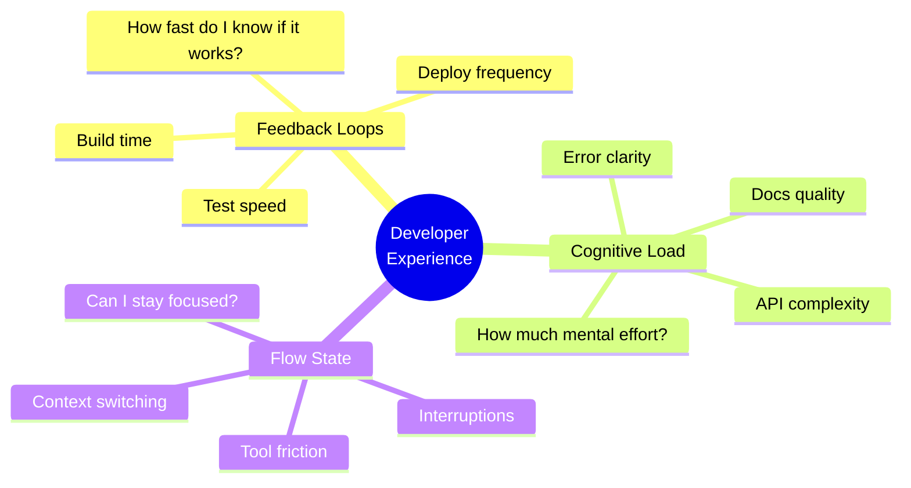
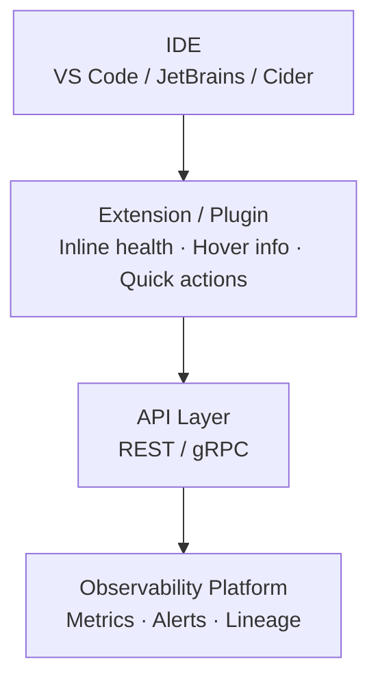
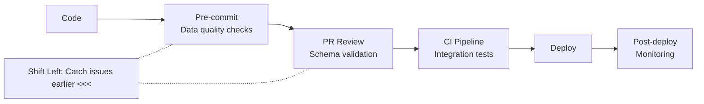
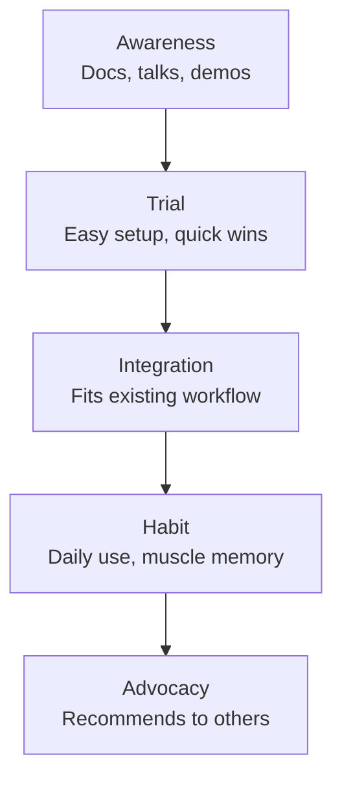

import { Card, CardGrid, LinkCard } from '@astrojs/starlight/components';

## About This Module

Your observability platform will only succeed if developers actually use it. That means meeting them where they already work — in their IDE, their terminal, their CI/CD pipelines, and their daily workflows. This module covers the principles of developer experience (DevEx), practical patterns for IDE and CLI integration, and how the best developer tools companies embed their products into engineering workflows.

This is where the rubber meets the road: how do you take everything from Modules 1-5 and make it accessible to a software engineer who never leaves their code editor?

**Estimated Study Time: 1.5 hours**

---

## Section 1: Developer Experience (DevEx) Principles and Research

**Developer Experience (DevEx)** is the sum of all interactions a developer has with a tool, platform, or system. Good DevEx means the tool is fast, intuitive, well-documented, and integrated into existing workflows. Bad DevEx means friction, context-switching, and manual toil.

### The three dimensions of DevEx (from research):

Recent research from the DevEx research community identifies three core dimensions:

1. **Feedback loops**: How quickly developers get feedback on their work. Fast compile times, instant test results, real-time monitoring — all reduce the feedback loop. For observability: how quickly can an engineer see the health of their pipeline after deploying a change?

2. **Cognitive load**: How much mental effort is required to use the tool. Complex UIs, unclear documentation, and too many configuration options increase cognitive load. For observability: can an engineer understand pipeline health at a glance, or do they need to learn a complex query language first?

3. **Flow state**: How well the tool supports uninterrupted, focused work. Every context switch — leaving the IDE, navigating to a different tool, waiting for a page to load — disrupts flow. For observability: can engineers check pipeline health without leaving their editor?

### Why DevEx matters for platform adoption:

Google engineers have access to world-class internal tools. If your observability platform has worse DevEx than what they're used to, they'll route around it. The bar is high:
- Tools must be fast (sub-second responses)
- Tools must integrate with existing workflows (not require new workflows)
- Documentation must be excellent (self-service, not "file a ticket")
- Failures must be transparent (clear error messages, not silent failures)

> **Key Insight**: "Developer experience is not about making things 'nice.' It's about reducing friction to the point where the right behavior (using the tool) is also the easy behavior. When observability is frictionless, adoption happens naturally."
> — [What Observability 2.0 Means for Developer Experience — LeadDev](https://leaddev.com/technical-direction/what-observability-2-means-developer-experience)

### Resources

- 📄 [What Observability 2.0 Means for Developer Experience — LeadDev](https://leaddev.com/technical-direction/what-observability-2-means-developer-experience) — How the next generation of observability tools must be designed around developer experience
- 📄 [DevEx: What Actually Drives Productivity — ACM Queue](https://queue.acm.org/detail.cfm?id=3595878) — Research paper defining the three dimensions of developer experience
- 📄 [Building the Developer Cloud — Scott Kennedy](https://www.scottkennedy.us/developer-cloud.html) — Architectural patterns for building developer-centric cloud platforms

---

## Section 2: IDE Integration Patterns — VS Code Extensions, JetBrains Plugins

The IDE is where developers spend most of their working hours. Bringing observability data into the IDE — rather than requiring developers to leave it — is the single highest-impact integration you can build.

### What IDE integration looks like for observability:

**Inline pipeline health indicators**: Show green/yellow/red status indicators next to pipeline code, similar to how linters show warnings inline. An engineer editing a pipeline definition sees its current health status without switching context.

**Hover information**: When an engineer hovers over a table name or pipeline reference, a tooltip shows key metrics — last run time, freshness, recent anomalies, data volume trend.

**Quick actions**: Right-click on a pipeline reference to "View in Observability Dashboard," "Show Recent Runs," or "Investigate Last Failure." The action opens the relevant view without manual navigation.

**Notifications in the IDE**: Alert the developer within the IDE when a pipeline they own has an issue, with a one-click link to investigate.

### Real-world examples:

**Datadog VS Code Extension**: Shows logs, traces, and vulnerability analysis directly in the editor. Engineers can navigate from code to observability data and back without leaving VS Code.

**Datadog JetBrains Plugin**: Same capabilities adapted for IntelliJ-based IDEs. Includes Code Insights that overlay runtime performance data on the source code.

**SonarLint**: While focused on code quality rather than data observability, SonarLint is an excellent model for IDE integration — it provides instant feedback on code quality issues inline, right where the developer is working.

### Google-specific considerations:
Google uses an internal IDE environment (Cider/Cloud-based development). Your IDE integration strategy needs to work within this ecosystem. The patterns are the same — inline health, hover info, quick actions — but the implementation target is Google's internal IDE infrastructure.

> **Key Insight**: "The best IDE integrations are invisible. They don't add new panels or windows — they add information to the views developers already use. The goal is augmentation, not addition."
> — [Datadog IDE Plugins Documentation](https://docs.datadoghq.com/developers/ide_integrations/)

### Resources

- 📄 [Datadog VS Code Extension — Docs](https://docs.datadoghq.com/developers/ide_plugins/vscode/) — How Datadog integrates observability data directly into VS Code
- 📄 [Datadog JetBrains Plugin — Docs](https://docs.datadoghq.com/developers/ide_plugins/idea/) — JetBrains IDE integration for Datadog's observability features
- 📄 [Datadog IDE Integrations Overview — Docs](https://docs.datadoghq.com/developers/ide_integrations/) — Full overview of Datadog's IDE integration strategy and capabilities
- 📄 [Cider: What IDE Stack Does Google Use Internally — Medium](https://medium.com/@bhagyarana80/cider-what-ide-stack-does-google-use-internally-vs-code-intellij-or-something-else-0d67f9e2481d) — Overview of Google's internal IDE infrastructure

---

## Section 3: CLI Tools and CI/CD Integration for Observability

Not every developer interaction happens in an IDE. CLI tools and CI/CD integration bring observability into the command line and automation workflows.

### CLI tools for observability:

A well-designed CLI lets developers:
- **Check pipeline status**: `obs status my-pipeline` — instant health check from the terminal
- **Query metrics**: `obs query "freshness of maps-tile-pipeline in last 24h"` — natural language or structured queries
- **View recent incidents**: `obs incidents --mine` — what's broken that I own?
- **Trigger investigations**: `obs investigate pipeline-failure-12345` — launch an AI-powered investigation from the command line

### CI/CD integration:

**Shift-left observability** means catching data quality issues earlier in the development process — ideally before code is merged, not after it's deployed to production.

Patterns for CI/CD observability:
- **Pre-merge checks**: Automatically validate that schema changes won't break downstream consumers. Run this as a CI check on pull requests.
- **Post-deploy validation**: After a pipeline change is deployed, automatically run observability checks to verify the change didn't introduce regressions.
- **Canary analysis**: Compare metrics from the new pipeline version against the old version. Flag statistically significant regressions before rolling out fully.
- **Automated rollback**: If observability checks detect quality degradation after a deploy, automatically roll back to the previous version.

### The shift-left philosophy:
Traditional observability is reactive — you monitor production and respond to issues. Shift-left observability is proactive — you catch issues in development, testing, and staging before they reach production. This is the direction the industry is moving.

> **Key Insight**: "Shift-left observability isn't about moving monitoring earlier — it's about making data quality a first-class concern in the development workflow, just like code quality is today."
> — [Shift-Left Observability for Modern DevOps — DevOps.com](https://devops.com/modular-shift-left-observability-for-modern-devops-pipelines/)

### Resources

- 📄 [Shift-Left Observability for Modern DevOps — DevOps.com](https://devops.com/modular-shift-left-observability-for-modern-devops-pipelines/) — How to integrate observability into CI/CD pipelines and development workflows
- 📄 [Shift Right and Observability — Dynatrace](https://www.dynatrace.com/news/blog/shift-right-in-software-development-adapting-observability-for-a-seamless-development-experience/) — Balancing shift-left (development) with shift-right (production) observability
- 📄 [Observability Tools for Platform Engineers 2026 — Platform Engineering](https://platformengineering.org/blog/10-observability-tools-platform-engineers-should-evaluate-in-2026) — Survey of observability tools with CLI and CI/CD integration capabilities

---

## Section 4: How Developer Tools Companies Embed in Workflows

The most successful developer tools don't ask developers to change their workflows — they embed themselves into existing ones. Here's how the best companies do it:

### Pattern 1: Meet developers where they are
Datadog, Sentry, and LaunchDarkly all provide IDE extensions, CLI tools, browser extensions, and Slack integrations. The strategy: be available in every tool the developer already uses, so they never need to "go to" the observability tool.

### Pattern 2: Make the default behavior the instrumented behavior
The best observability tools require minimal setup. Auto-instrumentation (detecting and monitoring systems without manual configuration) is the gold standard. If developers have to explicitly opt in to monitoring, most won't.

### Pattern 3: Make data actionable, not just visible
Dashboards are necessary but not sufficient. The winning pattern is: detect → investigate → remediate, all within the same tool. Showing a graph of pipeline latency is good. Showing the graph + identifying the root cause + suggesting a fix is great.

### Pattern 4: Build for the engineering culture
At Google, this means:
- **Design doc integration**: Observability insights available during the design review process
- **Code review integration**: Pipeline health data visible in code review tools (Critique)
- **Oncall integration**: When an oncall engineer gets paged, observability data is automatically surfaced alongside the alert
- **Postmortem integration**: Observability data auto-populates postmortem templates

### Pattern 5: Invest in developer education
Documentation, tutorials, and examples are not optional — they're a core product feature. The best developer tools companies (Stripe, Twilio, Vercel) treat their docs as carefully as their APIs.

> **Key Insight**: "The most successful developer tools are the ones that engineers recommend to each other. This only happens when the tool genuinely makes their work easier, faster, or more enjoyable. Mandates create compliance; great DevEx creates adoption."
> — [Software Engineering with LLMs in 2025 — Pragmatic Engineer](https://newsletter.pragmaticengineer.com/p/software-engineering-with-llms-in-2025)

### Resources

- 📄 [Software Engineering with LLMs in 2025 — Pragmatic Engineer](https://newsletter.pragmaticengineer.com/p/software-engineering-with-llms-in-2025) — How LLMs are changing developer workflows and what it means for tool builders
- 📄 [Building the Developer Cloud — Scott Kennedy](https://www.scottkennedy.us/developer-cloud.html) — Principles for building developer-centric platforms that embed in workflows
- 📄 [What Observability 2.0 Means for Developer Experience — LeadDev](https://leaddev.com/technical-direction/what-observability-2-means-developer-experience) — The convergence of observability and developer experience

---

## Key Takeaways

- **DevEx has three dimensions**: feedback loops, cognitive load, and flow state. Your observability platform must optimize all three.
- **IDE integration** is the highest-impact touchpoint — bring pipeline health, alerts, and investigation capabilities into the editor where engineers already work.
- **CLI tools and CI/CD integration** enable shift-left observability — catching data quality issues before they reach production.
- **The best tools embed in existing workflows** rather than requiring developers to adopt new ones. Auto-instrumentation, contextual surfacing, and actionable insights are the winning patterns.
- **At Google**, the bar for DevEx is exceptionally high. Your platform needs to integrate with internal tools (Cider, Critique, Piper) and match the quality engineers expect from internal tooling.

---

## Reflect & Apply

1. **The IDE integration plan**: If you could ship one IDE integration feature first, what would it be? Inline pipeline health? Hover information? Alert notifications? Why that one?

2. **Shift-left for your team**: What data quality checks could you add to the CI/CD pipeline for teams that build data pipelines? What would you check pre-merge vs. post-deploy?

3. **Adoption strategy**: Google engineers don't have to use your platform — they choose to or not. Without mandates, how do you drive adoption? What "aha moment" would make an engineer tell their teammates about your tool?
